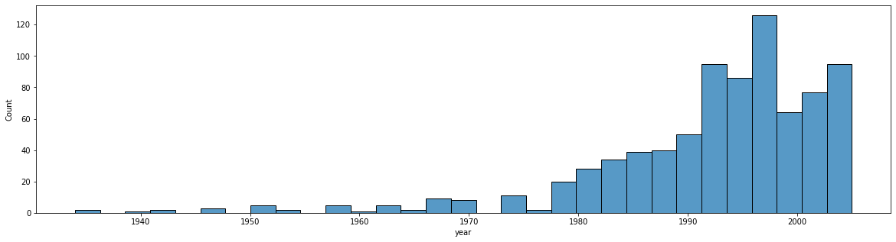

# 팀 로고

    

# 프로젝트 목적

 추천시스템 연구 및 학습 용도로 많이 사용되는 MovieLens 데이터를 이용하여 사용자들의 implicit feeback을 기반으로 각 유저당 10개의 영화를 추천하는 대회입니다. 

 해당 대회에서 추천해야할 10개의 영화는 단순히 해당 사용자의 데이터를 토대로 마지막으로 볼 영화만 추천하는 것이 아니라, 사용자의 기록 중 time-ordered sequence에서 일부 item들을 고의적으로 누락된 item도 맞추어야 합니다. 

 결국 단순히 static한 모델로 마지막 영화만 맞추는 것이 아니라 sequential한 모델로 중간에 비어있는 영화들도 맞추어야 하는 대회입니다.

# 팀 구성

- 권용훈 김정훈 정승환 최종현 한광석

# EDA

## 1. 대회 시나리오

 해당 대회는 implicit feedback으로 top K개를 추천하는 것이다. 일반적인 추천시스템인 마지막 item을 예측하는 sequential recommendation과 달리 item sequence의 일부 item이 랜덤하게 샘플링 되어 test set으로 활용된다. 

💡 Sequence 모델과 Static 모델의 적절한 앙상블이 높은 효과를 가져올 것이다.   
💡 Rating 값이 존재하지 않는다.

## 2. Data unique

| 전체 유저 수 | 31360 |
| --- | --- |
| 전체 영화 수 | 6807 |
| 전체 장르 수 | 18 |
| 전체 감독 수 | 1340 |
| 전체 작가 수 | 11306 |

## 3. 결측치/이상치 분석
- 유저가 관측한 영화의 수: 6807

→ 모든 영화가 시청되었다.

- 연도가 없는 영화가 있는데, 제목에 연도가 같이 적혀있다

 → 전처리 필요

- Director 데이터를 가지고 있지 않은 영화가 많다.
- Writer 데이터를 가지고 있지 않은 영화가 많다.
- 모든 영화가 장르 데이터를 가지고 있다.
- 우주전쟁(2005)라는 영화가 2개가 존재한다 → 각 영화의 장르가 약간 다르지만 나머지는 동일

## 4. 데이터 분석

### Basic

💡 20Million Movie lens 데이터에 비해서 적은 데이터 양 이다. sparse 비율이 0.97 정도로 기존의 추천 데이터셋에 비해서 매우 dense한 편이다. 유저와 영화의 상환 관계 만으로도  높은 결과가 이루어 질 수 있다 판단.

| 가장 많은 영화를 본 사람 | 2912 |
| --- | --- |
| 가장 조금 영화를 본 사람 | 16 |
| 1000개 이상 영화를 본 사람 | 110 |
| 평균 영화 본 횟수 | 164.36450... |

### Year

1922~ 2014년 데이터 가 있다.   
💡 해당 유저가 영화를 본 구간에서 추천한다면 결과를 높일수도 있지 않을까 판단?

### Genre
총 18개의 장르 하나의 영화가 여러개의 장르를 가질 수도 있다.

- 전체 목록
    
    'Action' 'Adventure' 'Animation' 'Children' 'Comedy' 'Crime'
    'Documentary' 'Drama' 'Fantasy' 'Film-Noir' 'Horror' 'Musical' 'Mystery'
    'Romance' 'Sci-Fi' 'Thriller' 'War' 'Western'
    

## 5. 특이사항

- 영화를 본 유저에 대한 정보 외에도, 영화의 연도, 작가, 감독, 장르에 대한 정보가 있으니, side information 정보를 활용하는 것이 점수 상승에 요소가 될 수 있지만, 기본적인 interaction을 먼저 반영하는 모델을 만들 필요가 있다. 왜냐하면 이러한 side information은 약한 상관관계를 가질 확률이 높다. 해당 정보를 context 기반 모델에 적용하는 것이 좋을 수는 있지만, 선택할 필요는 있어보인다. (감독이나 영화 장르 정보는 어느 정도 취향을 반영할 확률은 높지만, 작가에 대한 정보는 오히려 너무 고차원의 interaction으로도 볼 수 있다)
- n 분 동안 수 십편을 영화를 평가한 사람이 있다. 기존에 본 영화에 대해서 한번에 평점을 매긴 것 같다.
- 감독, 작가의 수는 적으면 적을수록 중복되는 영화가 많다는 의미이므로 의미있는 정보가 될 수 있다.
- 감독 한명이 만든 영화 수는 평균 4.11개로, 특정 감독의 연출 스타일을 선호하는 유저에게 추천해 줄 수 있는 의미있는 정보가 될 수 있다.
- 작가는 감독에 비해 전체적인 수가 많았으며, 작가 한명 당 평균적으로 영화 1.89편에 참여했으며, 영화에는 평균적으로 2.00명의 작가가 참여한다.
- 작가는 감독에 비해 중복되는 수가 적어 표현력이 약할 것으로 예상되며 경험적으로 영화는 작가에 의해 선택하기 보다는 감독에 의해 선택하는 경우가 많으므로, 필요한 경우 drop시키는 것도 고려해볼만 하다.
- 영화는 여러개의 장르를 가질 수 있으며, 평균적으로 2.34개의 장르를 가진다.
- 같은 장르에 포함되는 영화의 수는 평균 378.17편이나, 장르별 편차가 크기 때문에 일반화하기 어렵다.
- 전체 영화의 연도별 분포는 다음과 같다.
    
    
    
- 유저별 연도별 분포는 특정 구간에 집중된 유형(A)이 존재하고, 전체 분포와 비슷한 분포를 띄는 유형(B)이 존재한다. 특정 구간의 영화에 집중된 유저는 보통 극장에서 개봉된 영화를 봐서 시간적인 정보가 반영되었거나, 특정 구간 중에서도 오래된 영화에 집중된 경우 사용자의 연령대 등도 예상해 볼 수 있다. 이러한경우 year가 충분히 의미있는 feature가 될 수 있을 듯 하다.
    - USER A
        
        
        
    - USER B
        
        
        

# 모델 설명
## s3Rec (0.0884)
- Self-Supervised Learning for Sequential Recommendation with Mutual Information Maximization
- 기존에 주어진baseline 모델
- Item-Attirbute, Sequence-Item, Sequence-Attribute, Sequence-Sequence에 대한 정보를 pretrain 하여, 아이템이 가지 속성과 sequence를 적용할 수 있는 모델

## Bert4Rec (0.0998)
- 가운데 구멍이 뚫린 데이터 셋을 학습시킨다는 점 에서 데이터셋의 특성과 유사하다
- 양방향 데이터를 고려해 순서에 강하다는 점에서 어디에 구멍이 뚫린지 모르는 데이터 셋에 강할거라 판단
- 문제는 학습 시간이 너무 오래 걸린다는 점
- 중간에 masking을 넣어서 7일간 돌린 결과 0.0910 오히려 점수가 떨어짐

교훈: sequential 모델로 static 하려 하지 말자

- 하지만 앙상블시 좋은 효과를 보였으며 모든 모델에서  0.01점 올려주는 스톡 옵션이 되었다.

## NeuMF + BPR (0.1127)
- 모델은 Matrix Factorization을 일반화한 GMF layer와 MLP layer 그리고 두 layer를 합쳐 점수를 예측하는 NeuMF layer로 구성되어 있다.
- 우선 순위를 고려한 Loss인 BPR을 NeuMF에 적용했을 때, 0.1127로 가장 높은 점수가 나왔다.

## Mult-VAE (0.1409)
- 개요 : VAE for CF 논문에서 소개된 모델로, multinomial distribution VAE를 활용하여 아이템에 대한 사용자의 선호도 예측 및 추천 시스템을 구현
- 학습원리 : 사용자가 가지고 있는 영화에 대한 선호도(이 문제에서는 1 또는 0의 시청기록)을 Input으로 학습하여, 원래의 데이터를 가장 잘 표현하는 multinomial distribution을 찾고 결과적으로 사용자가 보지 않은 영화에 대한 matrix completion을 수행한다.
- 특이사항 : MovieLense 20M의 best parameter를 사용하여 학습하였으나, parameter 조절을 통한 성능 향상은 크게 없었고, 이를 통해 VAE 모델 기반의 matrix completion 문제가 data size에 independent할 수도 있다는 생각을 하게 되었다.

## EASE (0.1415)
- Embarrassingly Shallow Autoencoders
- hidden layer를 사용하지 않고 linear한 모델이고, closed-form solution을 유도할 수 있어서, autograd를 통한 학습이 아닌 단순한 계산으로 구현이 가능하고, 속도가 매우 빠르다.
- 특별한 전처리 없이도, 높은 점수가 나오고, 위에도 언급했듯이 매우 빠르다.

## RecVAE (0.1498)
- 개요 : Mult-VAE 모델을 몇 가지 측면에서 발전시킨 모델이다.
- 발전사항
1. 잠재벡터에 대한 새로운 사전 분포 (가우시안 + 이전 iteration의 잠재벡터)를 활용하여 강화학습의 효과를 얻을 수 있으며, 학습 stability가 높아진다.
2. kullback-leibler term에  hyperparameter $\beta$값 추가, $\beta$는 사용자 수와 item수에 따라 달라지며, 고정된 값 $\beta$ 대신에 입력 정보를 반영하는 $\gamma$값으로 대체 가능하다.
3. 인코더 - 디코더 교차 업데이트가 가능하다.
    1. 디코딩 레이어 한번 업데이트 할때 인코딩 레이어 여러번 업데이트 허용한다.
    2. 단순한 디코딩 레이어 - 복잡한 인코딩 레이어 구조를 사용 가능하게 한다.
    3. clean 데이터를 디코더에 훈련시키면서, noised 데이터를 인코더에 사용할 수 있다.
- 특이사항 : input과 output이 Mult-VAE 모델과 완전히 동일하며, model의 parameter update term에만 차이가 있다. 따라서, VAE를 활용한 발전된 모델에서도 이러한 방법론을 적용할 수 있는 가능성이 존재한다.

## VASP (0.1450)
- movielens 1m 데이터 셋에서 가장 높은 성능을 냈다고 알려진 모델이라 사용했다.
- 또한 가장 높은 성능을 내었던 EASP, VAE를 합친 모델이라 결과가 나쁘지 않을거라 예상했다.
- 2번재로 높은 성능을 내었으며 앙상블해서 사용하였다.

## Item 기반 CF (0.0600)
- 단순히 Cosine Similarity 기반으로 돌렸을때 나온 점수 인기도 기반 추천 (0.0324)보다는 좋은 점수를 보였다.

## User 기반 CF (Undefined)
- 한 사람당 30초의 추천시간이 필요 예상 소요 시간이 너무 길어 포기 했다.
- 파이썬 함수를 사용한 것이 패인

교훈: numpy, pandas 내장 함수를 무조건 이용하자

# 발전 과정, 프로젝트 수행 결과
## Most Populer 0.0324
- 기존에 제공된 코드에 많이 본 영화순으로 best 10을 제출했을 경우, 약 0.0324가 나오는 것으로 보아, 6807개의 영화 중에서 10개만으로 제출하더라도 약 3% 확률로 맞춘다고 볼 수 있다. 만약에 비슷한 확률로 서로 다른 영화 2개를 추천한다면 이 중에서 많이 본 영화순으로 정렬하는 것이 도움이 될 확률이 있어보인다.

## Cosine Similarity →  0.0600
- 단순히 Cosine Similarity 기반으로 추천을 해줬을 경우, 0.0600으로 top10보다 높은 점수를 얻을 수 있었고, 각 영화간의 interaction이 어느정도 중요한 것을 알 수 있었다.

## s3Rec → 0.0884
- baseline 모델인 s3rec을 실제로 돌려보고, 0.0884의 점수를 얻을 수 있었지만 해당 점수가 높은 것인지 낮은 것인지 판단할 수 없었다.

## NeuMF + BPR → 0.1127
- 많은 논문들을 살펴보면 NeuMF가 baseline으로 많이 사용된다고 느꼈다. 그래서 해당 모델을 이해하고자 논문을 읽고 구현해보았다. 한 번 학습 시 많은 시간이 소요돼 epoch를 5정도로 하고 latent dimension도 16으로 했다. 나중에 epoch를 늘려보고 latent dimension도 늘려봤지만, 성능은 0.112x에서 머물렀다. NeuMF 모델의 한계로 판단해 최적의 hyper parameter 찾는 것을 중단하였다.
- NeuMF 모델에 BPR을 적용했다. BPR을 적용하지 않았을 때보다 성능이 0.0006 증가하였다.

## NeuMF + Bert4Rec → 0.1287
- NeuMF 와 Bert 를 7:3 비율로 중복 없이 넣었다.
- NeuMF 모델의 기본 0.1127 에서 대략 0.01 의 상승

## MultiVAE + Bert4Rec → 0.1511
- MultiVAE 와 Bert 를 7:3 비율로 중복 없이 넣었다.
- MultiVAE 모델의 기본 0.1405 에서 대략 0.01 의 상승

## EASE + Bert4Rec → 0.1524
- EASE  와 Bert 를 7:3 비율로 중복 없이 넣었다.
- EASE 모델의 기본 0.1415 에서 대략 0.01 의 상승

## RecVAE + Bert4Rec → 0.1581
- RecVAE 와 Bert 를 7:3 비율로 중복 없이 넣었다.
- RecVAE  모델의 기본 0.1498 에서 대략 0.01 의 상승

## Static(MultiVAE + EASE + RecVAE) + Sequential(Bert4Rec) ensemble → 0.1591
- 비슷한 값을 도출하면서 단일 모델로 성능이 좋은 MultiVae와 EASE, RecVae 모델을 먼저 hard voting을 하여, 최소한 2개 이상의 값이 겹치는 경우에만 선택이 되도록 하여, 먼저 제출할 파일을 만들어준다. 이렇게 될 경우 각 유저당 10개의 데이터 중 8개의 데이터, 즉 80% 데이터만 채워진다. 그리고 남은 데이터를 static한 모델이 아닌 sequential한 모델인 Bert4Rec을 이용하여, Bert4Rec의 Top  K 순으로 빈 데이터를 채워서 제출하였다.
- 기존에 최고 성능인 RecVAE와 Bert4Rec의 7/3 조합보다 엄청나게 높은 성능은 아니지만, 약간의 상승이 있었고, private score에서도 해당 방식이 조금 더 robust할 것으로 기대된다.

## Static(VASP + EASE + RecVAE) + Sequential(Bert4Rec) ensemble → 0.1604
- 새로운 모델인 VASP를 도입하여, 앙상블을 시도하였다. 위와 동일하게 혼자 선택한 데이터는 빼고, 겹친 결과들만 뽑고, 나머지 값을 sequential 모델인 Bert4Rec을 이용하여 채워서 제출하였다.

# 자체 평가 의견
- 권용훈
    
    주로 AutoEncoder 계열 성능이 잘 나왔는데 성능이 잘 나온 모델로 파라미터를 수정하지 않는것이 패착이었다. 더 많은 모델을 시도한것 보다 더 중요한듯 하다. 
    
- 정승환
    - 여러가지 가설을 세우고, 해당 가설을 실험하기 위해 모델을 탐색하고 구현하는 과정에서 모델의 특성에 대한 이해도를 높일 수 있었음
    - 하나의 모델을 깊이 있게 탐색하기 보다는 모델 간의 차이를 중점적으로 보며 다양한 모델을 파악하는 방식으로 접근했기 때문에, 각 모델을 완벽하게 이해하고 성능을 최대로 끌어내지 못한 부분이 아쉬움
    - 다음 프로젝트에서는 모델에 대한 깊이 있는 수학, 통계학적 이해를 위해 노력하며, 성능을 무조건 많이 높이는 것이 아닌 성능을 의도하고 예상한 만큼 높이는 것에 집중하고자 함
- 최종현
    
    추천시스템을 공부하면서 데이터에 따라 성능이 달라지고, 평가 지표에 따라서도 성능이 달라진다는 점을 알고나서 다른 이론에 비해 더 복잡하다고 느껴졌습니다. CF 계열의 모델이 성능이 좋은 편인 것을 보고 생각보다 딥러닝이 추천시스템에 맞지 않다는 것을 느꼈고, 성능이 가장 좋은 모델이 Recall 값 기준 0.16~0.17인 것을 보고 추천시스템 모델이 과연 서비스에 의미가 있을까? 라는 의문이 들었습니다. 저희 조는 아무래도 5명이 다 RecSys를 처음 공부하는 입장이다보니 협업보다는 연구에 치중하였는데 이 부분은 어쩔 수 없다고 느꼈습니다. 만약 다음 번에 비슷한 주제로 competition을 한다면 어떤 식으로 역할을 나눌지 고민할 필요가 있다고 생각이 들었습니다.
    
- 한광석
    
    여러 모델을  공부하고 구현해서 추천 시스템의 동작 원리를 파악할 수 있었다. 단일로 성능이 준수하게 나오는 모델이 auto encoder 계열이었다. 또한, Bert4Rec을 같이 섞으니 성능이 0.01은 올랐다. 하지만, Auto encoder는 hyper parameter에 민감한데 hyper parameter 튜닝을 하지 못 했고,  Bert4Rec외에 다른 sequential 모델에 도전하지 않았다. 만약 이 2가지를 잘 했다면, 대회 순위가 더 좋아졌을 것 같다.
    
- 김정훈
    
    private 점수가 public 점수보다 많이 낮게 형성되었다. 결국 해당 각 모델별로 배깅을 사용하지 않고, 하나의 seed의 결과로만 데이터를 만들다보니 robust한 모델을 만들지 못했다. 각 모델별로도 다양한 seed를 넣어서 배깅을 한 결과값을 사용해야겠다.
    
    단일 모델에서 한번의 시도로 각 모델의 성능을 평가하였는데, 이렇게 하다보니 각 모델이 가지고 있는 최대치를 이끌어내지 못했다. 단순히 한번 돌린걸로 제일 좋은 성능의 모델을 찾고, 그 후에 하이퍼 파라미터를 조정하려고 했는데 잘못된 생각이었다.  처음에 사용한 모델들이 학습 속도시간이 오래 걸렸기 때문에, 이러한 작업에 대해서 인지를 못하고 있었다. 학습속도가 빠른 EASE 모델에서는 다양한 시도를 할 수 있었지만, 이러한 경험을 토대로 그냥 시도를 하지 않아서 제일 좋은 성능을 가진 모델을 반쪽만 사용해서 좋은 성적을 거두지 못했다. 각 모델별로 학습시간에 따라서 차이를 두면서 하이퍼 파라미터 튜닝을 해서 각 모델이 가진 최대치를 토대로 각 모델들을 평가해야겠다.